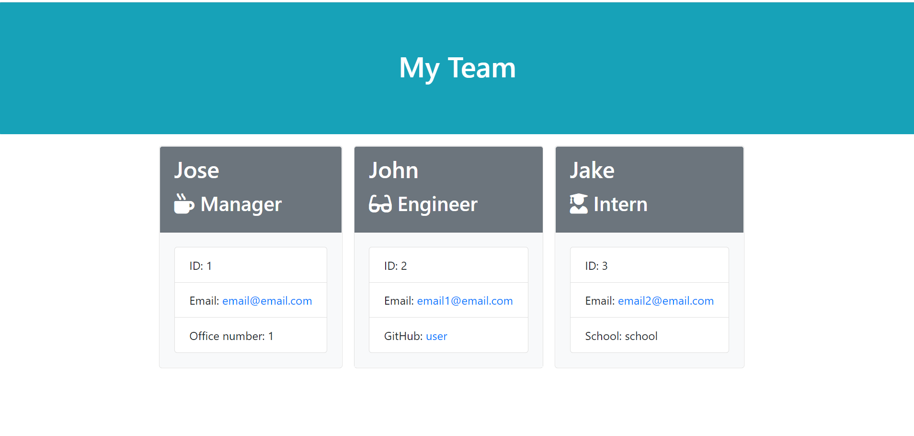

# employee-summary

## Description

This application is a test-driven application. The Employee, Engineer, Intern, and Manager JS files in the lib folder were developed to pass the tests in their corresponding test JS files in the test folder. Each of the JS files in the lib folder has a class to build a type of employee. The parent class is the Employee class in the Employee.js file in the lib folder. The Engineer, Intern, and Manager classes in their corresponding JS files extend from the parent Employee class. 

The app.js file is the main application which initially prompts the user to provide information about employees. Depending on the type of employee selected, the application uses the correct class to build that type of employee. The employees are saved to an array. Once the user adds the last employee the application passes the array to the htmlRender.js file and starts building the HTML page using the templates in the templates folder. After the HTML file is built, the application saves it to the output folder.

Here is a screenshot of the final output after entering employee information:

## Table of Contents

* [Installation](#installation)
* [Usage](#usage)
* [License](#license)
* [Contributing](#contributing)
* [Tests](#tests)
* [Questions](#questions)

## Installation

The application uses the inquirer and jest npm packages. To install them run npm install on the terminal you're using to interact with the application.

## Usage

To use the application simply run it using node by typing node app.js on the terminal you're using to interact with the application.

## License

[MIT](https://choosealicense.com/licenses/mit/)

## Contributing

Contributions are currently not accepted for this project.

## Tests

The test npm package used in this application is jest. To run a test simply type npm run test on the terminal you're using.

## Questions

My GitHub username is: chavalk

Link: https://github.com/chavalk

If you have additional questions, feel free to reach me at chavalk@hotmail.com.